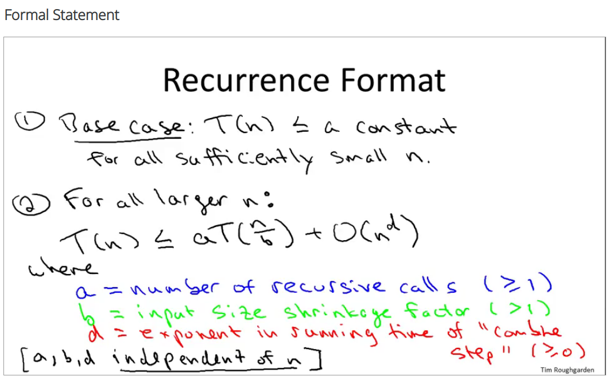

# Python codes for Coursera Algorithms

---

[Coursera algorithms](https://www.coursera.org/learn/algorithms-divide-conquer/lecture/NtFU9/merge-sort-pseudocode)

Python 3 version

## Karatsuba Multiplication

## Merge Sort

## Big-O notation

Formal definition: $T(n) = O(f(n))$ if and only if there exist $c, n_0 > 0$, such that $T(n) \leq cf(n)$ for all $n \geq n_0$.

## Omega notation

Formal definition: $T(n) = \Omega(f(n))$ if and only if there exist $c, n_0 > 0$, such that $T(n) \geq cf(n)$ for all $n \geq n_0$.

## Theta notation

Formal definition: $T(n)=\theta(f(n))$ if and only if $T(n)=O(f(n))$ and $T(n)=\Omega(f(n))$. 
there exist $c_1, c_2$, such that $T(n) \geq c_1 f(n)$ and $T(n) \leq c_2 f(n)$ for all $n \geq n_0$.

## Counting inversions

Couting inversion means that 

 $i, j$ form an inversion if $a_i > a_j$, that is, if the two elements $a_i$ and $a_j$ are "out of order".

Finding "similarity" between two rankings. Given a sequence of n numbers 1..n (assume all numbers are distinct). Define a measure that tells us how far this list is from being in ascending order.  The value should be 0 if $a_1 < a_2 < ... < a_n$ and 
should be higher as the list is more "out of order".

## Strassen's Subcubic Matrix Multiplication Algorithm

## The master method for asymptotic analysis of divide and conquer algorithms

## QuickSort 

### implementation

### Example

### Background knowledge

Utilized linearity of Expectation and decomposition principle

A good exercise is the birthday problem with the solution in [Introduction of Algorithms](https://books.google.de/books?id=NLngYyWFl_YC&pg=PA106&lpg=PA106&dq=birthday+problem+introduction+to+algorithms&source=bl&ots=BzSoIz0kHa&sig=ACfU3U177Hw1_m4xZFxmfM6JMoSxLSoNaA&hl=en&sa=X&ved=2ahUKEwjIr5Du4YjhAhUPy6YKHadKCtAQ6AEwBXoECAkQAQ#v=onepage&q=birthday%20problem%20introduction%20to%20algorithms&f=false)

### Asymptotic analysis and proof

